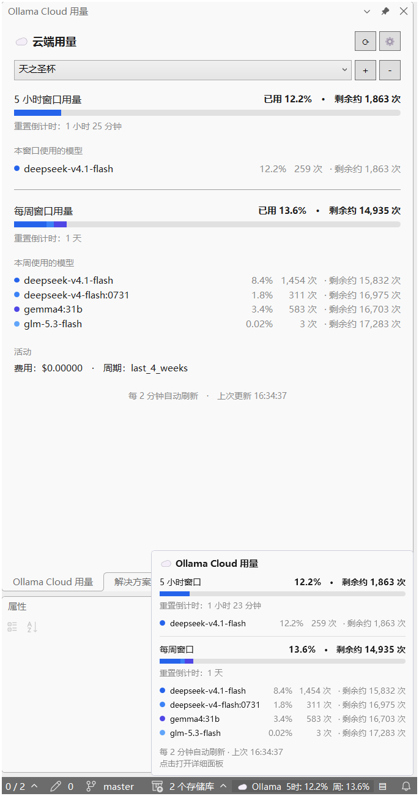

# Vancat.OllamaCloudUsage

View [Ollama Cloud](https://ollama.com) usage and limits in Visual Studio — a live status bar indicator plus a detailed tool window.

> Design reference: [ollama-cloud-usage](https://github.com/longnh0411/ollama-cloud-usage) (VS Code extension)

[中文文档](README.md) | **English**

## 📷 Screenshots

Usage panel (left), status bar hover popup (bottom right), and status bar indicator (bottom):



## ✨ Features

- **Status bar usage indicator** — shows session (5-hour) and weekly window usage percentages live in the Visual Studio status bar:
  - 🖱️ **Hover** — opens a detailed popup (usage bars, model request list, remaining request prediction, reset countdown)
  - 👆 **Click** — opens the usage panel tool window directly
  - ▤ **Shortcut button** — the button on the right opens the detailed panel in one click
- **Usage panel tool window** — open via **View > Other Windows > Ollama Cloud Usage Panel**:
  - Session and weekly usage bars, split by model with distinct colors
  - Reset countdown for each window (live updates)
  - Models used in this window / this week with request counts
  - **Per-model window share** — percentage of the window quota consumed by each model (see [Calculation Notes](#-calculation-notes))
  - **Remaining request prediction** — window-level and per-model estimates of remaining requests (see [Calculation Notes](#-calculation-notes))
  - Multi-account support: switch, add, and remove accounts from a dropdown
- **Auto-refresh** — usage refreshes automatically at a configurable interval (default 60 seconds).
- **Configurable usage precision** — the number of decimal places for usage percentages is adjustable (0–4, default 1); applies to the status bar, hover popup, and usage panel alike.
- **Cross-instance shared cache** — multiple Visual Studio instances share one usage cache and do not duplicate API requests.
- **UTC-anchored reset windows** — the session window resets on 5-hour boundaries (00/05/10/15/20 UTC); the weekly window resets Monday 00:00 UTC.
- **Secure storage** — API keys are encrypted with Windows DPAPI (current-user scope) and stored in `%APPDATA%\Vancat\OllamaCloudUsage\accounts.json`.
- **Theme adaptive** — the status bar control adapts to VS light, dark, and high-contrast themes.
- **Chinese/English switching** — the UI supports both languages, toggled via **Extensions > Ollama Cloud Usage > Switch Language**;
  on first run it follows the system language, and the choice is saved. The status bar, hover popup, usage panel, dialogs, and menus all switch live.

> 💡 **Status bar implementation note**: this extension injects a WPF control directly into the WPF status bar visual tree of the VS main window (instead of using the `IVsStatusbar` text API), which enables the hover popup, click interaction, and icon display.

## 📐 Calculation Notes

All calculations below are based on the raw values returned by the Ollama Cloud usage API (`https://ollama.com/api/usage`):
`limits.session.usage` / `limits.weekly.usage` are 0–1 fractions (`0.119` = 11.9%),
and `models[].request_count` is each model's request count within that window.

> 💡 Calculations use the **exact** `usage` value returned by the API, not the rounded percentage shown in the UI.
> For example, when the UI shows "Used 2%", the actual `usage` may be `0.023` (2.3%); all calculations use 2.3%.

### 1. Window usage percentage

Taken directly from the API:

$$P_{\text{window}} = usage \times 100\%$$

### 2. Per-model window share

The window usage is apportioned by each model's share of the window's total requests:

$$P_{\text{model}} = usage \times \frac{n_{\text{model}}}{N_{\text{window}}}, \qquad N_{\text{window}} = \sum_i n_i$$

**Property**: the shares of all models always sum to the window usage ($\sum P_{\text{model}} = usage$), which can be used as a cross-check.

Example (weekly window, `usage = 0.119`, 2,140 total requests):

| Model | Requests | Window share |
|---|---:|---:|
| deepseek-v4.1-flash | 1,243 | 11.9% × 1243/2140 = **6.9%** |
| gemma4:31b | 583 | 11.9% × 583/2140 = **3.2%** |
| deepseek-v4-flash:0731 | 311 | 11.9% × 311/2140 = **1.7%** |
| glm-5.3-flash | 3 | 11.9% × 3/2140 = **0.02%** |
| **Total** | **2,140** | **11.9%** ✓ |

### 3. Remaining request prediction

**Window capacity** — the total number of requests available before reset, at the current average consumption level:

$$C = \frac{N_{\text{window}}}{usage}$$

**Window-level remaining** — how many more requests the whole window can make:

$$R_{\text{window}} = C - N_{\text{window}} = N_{\text{window}} \times \frac{1 - usage}{usage}$$

**Model-level remaining** — how many requests this model could make if it were used exclusively:

$$R_{\text{model}} = C - n_{\text{model}}$$

> ⚠️ The model level uses the **window capacity** minus that model's used requests, and **not** $\frac{n_{\text{model}}}{usage} - n_{\text{model}}$.
> The latter is equivalent to assuming "this model's request count consumed the entire window usage", which yields absurd results:
> for example glm with only 3 requests (0.14% of weekly requests) would be reported as "22 remaining".

Example (weekly window, `usage = 0.119`, capacity $C = 2140 \div 0.119 \approx 17{,}983$):

| Item | Calculation | Result |
|---|---|---:|
| Window level | 17,983 − 2,140 | **15,843** |
| deepseek-v4.1-flash | 17,983 − 1,243 | **16,740** |
| gemma4:31b | 17,983 − 583 | **17,400** |
| deepseek-v4-flash:0731 | 17,983 − 311 | **17,672** |
| glm-5.3-flash | 17,983 − 3 | **17,980** |

**Edge cases**:

- `usage = 0` (no consumption yet) or the model has no request records → no prediction is shown
- `usage ≥ 100%` (quota exhausted or exceeded) → shows `0`
- Prediction is capped at 999,999; beyond that it shows `999,999+`

### 4. Display precision

The number of decimal places for usage percentages is configured via **Extensions > Ollama Cloud Usage > Set Usage Display Precision** (0–4, default 1),
and applies to the status bar, hover popup, and usage panel alike.

Per-model window share uses **adaptive precision**: if the current precision would render the value as `0.0%` (erasing a meaningful value),
the precision is raised automatically until it becomes visible (never beyond the 4-place limit). For example, glm's 0.0167% is displayed as `0.02%` at the default precision of 1.

### 5. Reset windows

The session (5-hour) window aligns to UTC 5-hour boundaries (00/05/10/15/20 UTC), and the weekly window is anchored to Monday 00:00 UTC —
matching the server-side rolling window model, unaffected by local time zone or daylight saving time.

## 🚀 Usage

1. Install the extension (see the build instructions below).
2. Add an API key via **Extensions > Ollama Cloud Usage > Add Account**.
3. The status bar shows usage immediately; **hover** for details, or **click** / press the ▤ button to open the full panel.
4. Usage refreshes automatically at the configured interval; in the panel you can click ⟳ to refresh manually or ⚙ to change the interval.

### Can't find the menu or panel?

- **Restart Visual Studio**: after installing a VSIX for the first time, a restart is required to load the extension.
- **Panel location**: **View (V) > Other Windows (E) > Ollama Cloud Usage Panel**.
- **Command location**: **Extensions (X) > Ollama Cloud Usage** submenu.
- **Quick access**: click the usage text or the ▤ button in the status bar.

## 📋 Commands

| Command | Location | Description |
|---|---|---|
| Refresh Usage | Extensions > Ollama Cloud Usage | Refresh immediately (bypasses the cache) |
| Ollama Cloud Usage Panel | View > Other Windows | Open the detail panel |
| Add Account | Extensions > Ollama Cloud Usage | Add a new API key |
| Remove Account | Extensions > Ollama Cloud Usage | Remove an existing account |
| Set Refresh Interval | Extensions > Ollama Cloud Usage | Change the refresh interval (10–86400 seconds) |
| Set Usage Display Precision | Extensions > Ollama Cloud Usage | Change decimal places for usage percentages (0–4, default 1) |
| Switch Language (中/EN) | Extensions > Ollama Cloud Usage | Switch between the Chinese and English UI |

## 🔨 Build

### Prerequisites

- Visual Studio 2022 (17.0+) or Visual Studio 2026, with the **Visual Studio extension development** workload installed
- .NET Framework 4.7.2 targeting pack

### Build steps

Double-click `构建扩展.bat`, or run this in a developer command prompt:

```powershell
& "C:\Program Files\Microsoft Visual Studio\18\Enterprise\MSBuild\Current\Bin\MSBuild.exe" `
    "Vancat.OllamaCloudUsage\Vancat.OllamaCloudUsage.csproj" /t:Rebuild
```

The output is at `Vancat.OllamaCloudUsage\bin\Debug\net472\Vancat.OllamaCloudUsage.vsix`.

### Debugging

Open `Vancat.OllamaCloudUsage.slnx` in Visual Studio and press F5 to launch the experimental instance (`/rootsuffix Exp`) for debugging.

## 📁 Project Structure

```
Vancat.OllamaCloudUsage/            # Solution directory
├── README.md                       # Chinese documentation
├── README.en.md                    # English documentation
├── 构建扩展.bat
├── Vancat.OllamaCloudUsage.slnx
└── Vancat.OllamaCloudUsage/        # Extension project
    ├── OllamaCloudUsagePackage.cs      # VSPackage entry point (command registration, lifecycle)
    ├── OllamaCloudUsage.vsct           # Command table (menu/button definitions)
    ├── StatusBarManager.cs             # Status bar control injector
    ├── InputDialog.xaml(.cs)           # Generic input dialog
    ├── AccountPickerDialog.xaml(.cs)   # Account picker dialog
    ├── Services/
    │   ├── OllamaApiClient.cs          # Usage API client + JSON parsing
    │   ├── AccountStore.cs             # Account storage (DPAPI encrypted)
    │   ├── SharedUsageCache.cs         # Cross-instance shared cache
    │   ├── UsageService.cs             # Core coordination service
    │   ├── ResetTime.cs                # Reset time calculation
    │   ├── QuotaPredictor.cs           # Remaining request prediction (window level)
    │   └── Config.cs                   # Configuration read/write
    ├── ToolWindows/
    │   ├── UsageToolWindow.cs          # Tool window host
    │   └── UsageToolWindowControl.xaml(.cs)  # Usage panel UI
    ├── Views/
    │   ├── OllamaStatusBarControl.xaml(.cs)  # Status bar control (hover popup + button)
    │   └── UsageBarRenderer.cs         # Shared usage bar renderer
    └── Resources/
        └── Icon.png                    # Extension icon
```

## 📄 License & Acknowledgements

This is an independently developed open source project. Its design references [ollama-cloud-usage](https://github.com/longnh0411/ollama-cloud-usage)
(Copyright 2026 Nguyễn Hoàng Long, Apache License 2.0), with sincere thanks.
