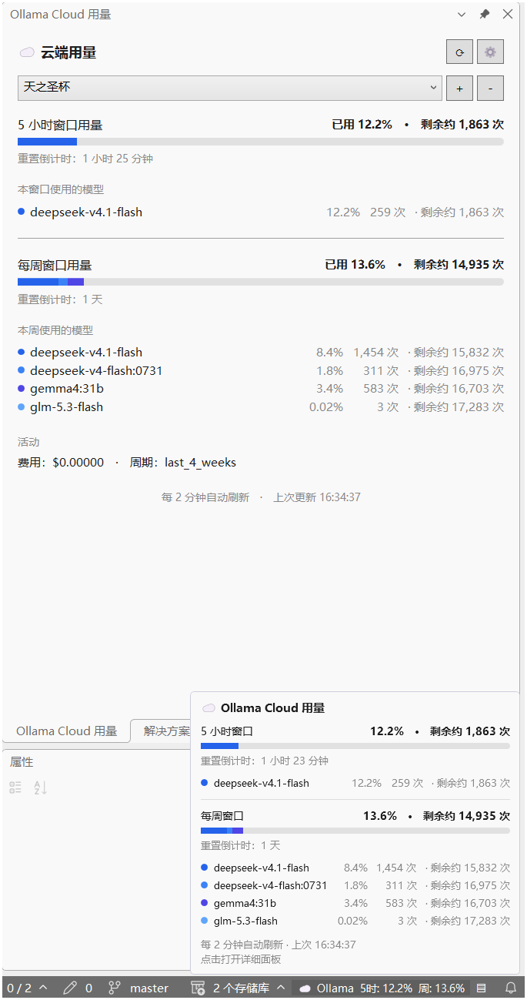

# Vancat.OllamaCloudUsage

在 Visual Studio 中查看 [Ollama Cloud](https://ollama.com) 用量与限额 —— 状态栏实时指示 + 详情工具窗口。

> 设计参考：[ollama-cloud-usage](https://github.com/longnh0411/ollama-cloud-usage)（VS Code 扩展）

**中文** | [English](README.en.md)

## 📷 截图

用量面板（左侧）、状态栏悬停浮窗（右下）与状态栏指示器（底部）：



## ✨ 功能

- **状态栏用量指示器** — 在 Visual Studio 状态栏实时显示会话（5 小时）与每周窗口的用量百分比：
  - 🖱️ **鼠标悬停** — 弹出详细浮窗（用量条、剩余次数预测、重置倒计时、请求历史迷你图）
  - 👆 **点击** — 直接打开用量面板工具窗口
  - ▤ **快捷按钮** — 状态栏右侧的按钮可一键打开详细面板
- **用量面板工具窗口** — 通过「视图 > 其他窗口 > Ollama Cloud 用量面板」打开：
  - 会话与每周用量条（单色分级：蓝色 → 75% 琥珀色 → 90% 红色）
  - 每个窗口的重置倒计时（服务端权威时间，实时更新）
  - **剩余次数预测** — 按当前平均消耗估算重置前还能请求多少次（详见[计算说明](#-计算说明)）
  - **请求历史图表** — 每小时（24 小时）与每天（7 天）的请求数迷你图表，含总量与峰值
  - 多账户支持：下拉切换、添加、移除账户
- **信用计划支持** — 若账户为信用计划，面板显示包含额度进度条与购买余额，状态栏改显额度已用百分比。
- **自动刷新** — 按可配置间隔（默认 60 秒）自动刷新用量。
- **限流提示** — API 返回 429 时提示需等待的秒数。
- **用量精度可配置** — 用量百分比的小数位数可调（0–4 位，默认 1 位），状态栏、悬停浮窗与用量面板同步生效。
- **跨实例共享缓存** — 多个 Visual Studio 实例共享同一份用量缓存，不会重复请求 API。
- **安全存储** — API 密钥经 Windows DPAPI（当前用户范围）加密后存储在 `%APPDATA%\Vancat\OllamaCloudUsage\accounts.json`。
- **主题自适应** — 状态栏控件自动适配 VS 浅色/深色/高对比度主题。
- **中英文切换** — 界面支持中英文双语，通过「扩展 > Ollama Cloud 用量 > 切换语言」一键切换；
  首次运行跟随系统语言，选择结果自动保存。状态栏、悬停浮窗、用量面板、对话框与菜单全部实时切换。

> 💡 **状态栏实现说明**：本扩展将 WPF 控件直接注入 VS 主窗口的 WPF 状态栏视觉树（而非使用 `IVsStatusbar` 文本 API），因此支持悬停浮窗、点击交互与图标显示。

## 🚀 使用

1. 安装扩展（见下方构建说明）。
2. 通过菜单「扩展 > Ollama Cloud 用量 > 添加账户」添加 API 密钥。
3. 状态栏会立即显示用量；**鼠标悬停**可查看详情，**点击**或按 ▤ 按钮打开完整面板。
4. 用量会按配置间隔自动刷新；面板中可点击 ⟳ 手动刷新，⚙ 修改刷新间隔。

### 找不到菜单或面板？

- **重启 Visual Studio**：首次安装 VSIX 后必须重启才能加载扩展。
- **面板位置**：菜单「视图 (V) > 其他窗口 (E) > Ollama Cloud 用量面板」。
- **命令位置**：菜单「扩展 (X) > Ollama Cloud 用量」子菜单。
- **快速入口**：直接点击状态栏的用量文字或 ▤ 按钮。

## 📐 计算说明

以下计算基于 Ollama Cloud 官方 2026-10-06 改版后的两个端点：

- `GET /api/usage?range=24h|7d` — 按小时/天分桶的请求计数（`request_count`），可选 `usage_usd` 等指标
- `GET /api/balance` — 各窗口的**剩余百分比**（`remaining_percent`）与**权威重置时间**（`resets_at`）

> 💡 计算使用的是 API 返回的**精确**数值，而非界面上四舍五入后的百分比。
> 例如界面显示「已用 2%」时，实际可能是 `2.3%`，所有计算均按 2.3% 进行。

### 1. 窗口用量百分比

余额端点返回的是**剩余**百分比，换算为已用比例：

$$P_{\text{已用}} = 1 - \frac{\texttt{remaining\_percent}}{100}$$

### 2. 窗口内请求数

`resets_at` 是当前窗口的**排他结束时刻**，因此窗口区间为 $[\texttt{resets\_at} - W,\ \texttt{resets\_at})$，
其中 $W$ 为窗口长度（会话 5 小时 / 每周 7 天）。窗口内请求数为与该区间重叠的分桶之和：

$$N_{\text{窗口}} = \sum_{\text{bucket} \cap [\texttt{resets\_at}-W,\ \texttt{resets\_at}) \neq \varnothing} \texttt{request\_count}$$

> 窗口边界取自服务端的 `resets_at`，与分桶网格（24h 为整点、7d 为 UTC 零点）对齐，
> 因此实际每个分桶要么完全在窗口内、要么完全在外。部分重叠的分桶按整桶计入——偏保守的近似，可避免低估。

### 3. 剩余次数预测

**窗口容量** — 按当前平均消耗水平，重置前总共可请求的次数：

$$C = \frac{N_{\text{窗口}}}{P_{\text{已用}}}$$

**剩余次数** — 还能再请求多少次：

$$R = C - N_{\text{窗口}} = N_{\text{窗口}} \times \frac{1 - P_{\text{已用}}}{P_{\text{已用}}}$$

示例（5 小时窗口：请求 102 次、已用 6%）：

$$C = \frac{102}{0.06} = 1700, \qquad R = 1700 - 102 = 1598$$

**边界处理**：

- $P_{\text{已用}} = 0$（窗口尚无消耗）或 $N_{\text{窗口}} = 0$（无请求记录）→ 不显示预测
- $P_{\text{已用}} \geq 100\%$（额度用尽）→ 显示 `0`
- 预测值上限 999,999，超出显示 `999,999+`

### 4. 信用计划

若余额端点返回的是信用计划形态（`allowance_usd` / `balance_usd`），则：

$$P_{\text{已用}} = \frac{\texttt{allowance\_usd} - \texttt{balance\_usd}}{\texttt{allowance\_usd}}$$

重置时间取自 `included.period.until`，同时显示已购买余额（`purchased.balance_usd`）。

### 5. 用量条配色

单色分级（新版 API 不再提供模型维度数据）：

| 已用比例 | 颜色 |
|---|---|
| < 75% | 🔵 蓝色 `#2563EB` |
| 75% – 90% | 🟡 琥珀色 `#D29922` |
| ≥ 90% | 🔴 红色 `#E5534B` |

### 6. 显示精度

用量百分比的小数位数通过「扩展 > Ollama Cloud 用量 > 设置用量显示精度」配置（0–4 位，默认 1 位），
状态栏、悬停浮窗与用量面板同步生效。

## 📋 命令

| 命令 | 位置 | 说明 |
|---|---|---|
| 刷新用量 | 扩展 > Ollama Cloud 用量 | 立即刷新（绕过缓存） |
| Ollama Cloud 用量面板 | 视图 > 其他窗口 | 打开详情面板 |
| 添加账户 | 扩展 > Ollama Cloud 用量 | 添加新的 API 密钥 |
| 移除账户 | 扩展 > Ollama Cloud 用量 | 移除已有账户 |
| 设置自动刷新间隔 | 扩展 > Ollama Cloud 用量 | 修改刷新间隔（10–86400 秒） |
| 设置用量显示精度 | 扩展 > Ollama Cloud 用量 | 修改用量百分比的小数位数（0–4，默认 1） |
| 切换语言 (中/EN) | 扩展 > Ollama Cloud 用量 | 在中文与英文界面之间切换 |

## 🔨 构建

### 前置要求

- Visual Studio 2022 (17.0+) 或 Visual Studio 2026，需安装 **Visual Studio 扩展开发** 工作负载
- .NET Framework 4.7.2 目标包

### 构建步骤

双击 `构建扩展.bat`，或在开发者命令提示符中执行：

```powershell
& "C:\Program Files\Microsoft Visual Studio\18\Enterprise\MSBuild\Current\Bin\MSBuild.exe" `
    "Vancat.OllamaCloudUsage\Vancat.OllamaCloudUsage.csproj" /t:Rebuild
```

产物位于 `Vancat.OllamaCloudUsage\bin\Debug\net472\Vancat.OllamaCloudUsage.vsix`。

### 调试

在 Visual Studio 中打开 `Vancat.OllamaCloudUsage.slnx`，按 F5 启动实验实例（`/rootsuffix Exp`）进行调试。

## 📁 项目结构

```
Vancat.OllamaCloudUsage/            # 解决方案目录
├── README.md                       # 中文文档
├── README.en.md                    # 英文文档
├── 构建扩展.bat
├── Vancat.OllamaCloudUsage.slnx
└── Vancat.OllamaCloudUsage/        # 扩展项目
    ├── OllamaCloudUsagePackage.cs      # VSPackage 入口（命令注册、生命周期）
    ├── OllamaCloudUsage.vsct           # 命令表（菜单/按钮定义）
    ├── StatusBarManager.cs             # 状态栏控件注入器
    ├── InputDialog.xaml(.cs)           # 通用输入对话框
    ├── AccountPickerDialog.xaml(.cs)   # 账户选择对话框
    ├── Services/
    │   ├── OllamaApiClient.cs          # 用量 API 客户端 + JSON 解析
    │   ├── AccountStore.cs             # 账户存储（DPAPI 加密）
    │   ├── SharedUsageCache.cs         # 跨实例共享缓存
    │   ├── UsageService.cs             # 核心协调服务
    │   ├── ResetTime.cs                # 重置时间计算
    │   ├── QuotaPredictor.cs           # 剩余请求次数预测（窗口级）
    │   └── Config.cs                   # 配置读写
    ├── ToolWindows/
    │   ├── UsageToolWindow.cs          # 工具窗口宿主
    │   └── UsageToolWindowControl.xaml(.cs)  # 用量面板 UI
    ├── Views/
    │   ├── OllamaStatusBarControl.xaml(.cs)  # 状态栏控件（悬停浮窗 + 按钮）
    │   └── UsageBarRenderer.cs         # 用量条共用渲染器
    └── Resources/
        └── Icon.png                    # 扩展图标
```

## 📄 许可与致谢

本项目为独立开发的开源项目。设计上参考了 [ollama-cloud-usage](https://github.com/longnh0411/ollama-cloud-usage)
（Copyright 2026 Nguyễn Hoàng Long，Apache License 2.0），在此致以诚挚感谢。
